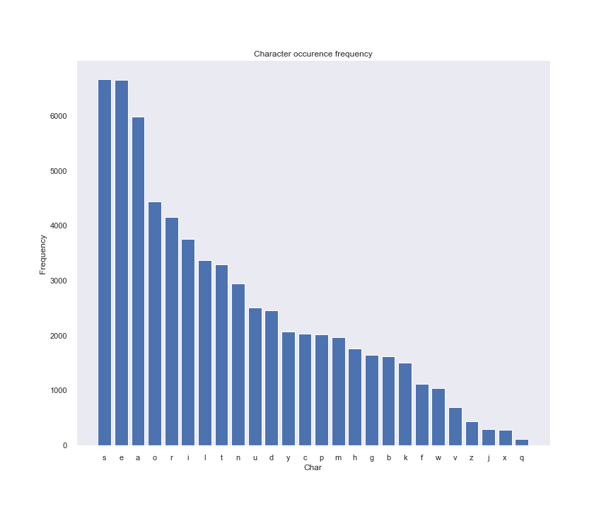
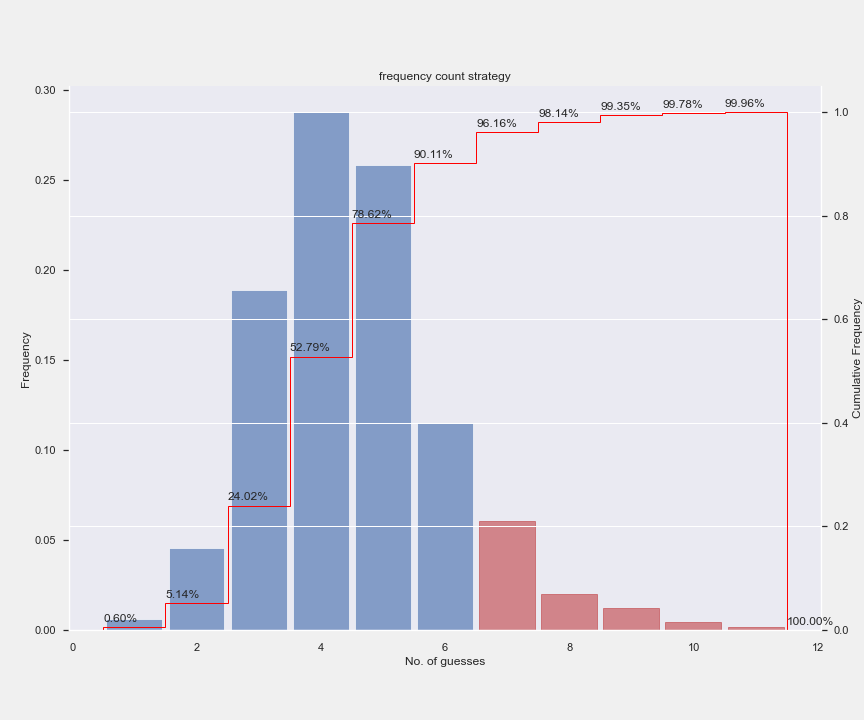
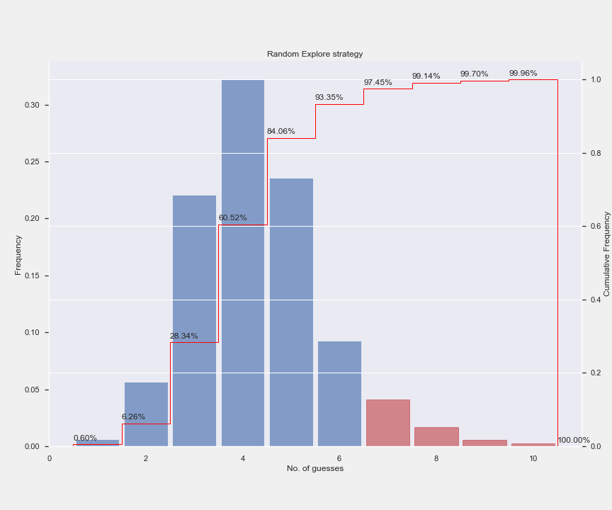

# Wordle Solver 
Wordle is a web-based word game which has become incredibly popular during the pandemic. It even got a Google doodle page. This is my own attempt at coming up with a solution strategy for the game.

# The game
The game is about guessing a five-letter word which changes every day. You get six tries to get it right. After every guess, the game tells you whether any of your letters are in the secret word and whether they are in the correct place. 

My initial attempts involved getting 5-letter words from a well-known corpus like NLTK. But it turns out that wordle uses a two smaller dictionaries which can be extracted from Javascript. The challenges are from the first dictionary which is a smaller one consisting of more familiar words. The second word list is a larger one, which consists of words that are accepted as guesses. Using a dictionary may sound like cheating, but I just wanted workout the mechanics of a solver for the game. 

## Base solution
The game is very similar to Master Mind game (which in turn is similar to even older game Bulls and Cow). As a base solution we can use Donald Knuth's Master Mind algorithm. The algorithm works as follows:
1. Create a set of candidates
2. Play an initial guess from this list and get the response
3. If the response is all green (`ggggg`) game is won
4. Otherwise, filter the candidate list to contain only those words that would give the response that we got. For example, if we guessed `ether` and got a response `rgggg` then we can reduce our candidate space to [`other`, `ither`]
5. Use a scoring strategy to choose the next best guess and repeat

Here is an abstract python implementation of parts of this algorithm:

```python
class Solver(ABC):
    def __init__(self, word_list):
        self.word_list = word_list
        self.first_word = self.top_word(word_list)

    def top_word(self, words):
        pass

    def next_guess(self, words, prev_guess=None, prev_result=None, explore=False):
        if not prev_guess:
            return self.first_word, words
        words = list(filter(lambda word: word_matches_pattern(word, prev_guess, prev_result), words))
        return self.top_word(words), words

    @abstractmethod
    def score(self, word, words, char_counts):
        pass
```

Now we need to choose an ideal scoring strategy that would allow us to make first guess as well as choose the best candidates among the remaining after every guess. This is where we can trial a few approaches and see which one gives the best result.


### Character frequency

As a first pass, we can prioritize guessing the words containing most common characters. This should increase our odds of landing on the correct word. For example, here is the frequency of characters appearing in all 5 letter words in the dictionary:



By this criteria, `soare` is the ideal first guess as it contains the most frequent characters.

```python
from collections import Counter

def top_word(self, words):
    char_counts = Counter()
    for w in words: char_counts.update(w)
    scores = [(self.score(word, words, char_counts), word) for word in words]
    scores.sort(reverse=True)
    return scores[0][1]

def score(self, word, counter):
    return sum(counter[c] for c in set(word))
```

True enough, it works well most of the time. Almost half the time, it only takes 3 attempts to guess the word correctly. And 9 out of 10 times we are able to guess within 6 attempts.



But we can do better. If we look at the words that take long to solve, there are multiple candidates which are too similar to them. For example, it takes 13 attempts to predict the word `wares`

```
time_solve('wares', word_list)
# Next guess, remaining word list
soare 12972
aesir 61
rales 32
tares 12
nares 11
dares 10
cares 9
pares 8
mares 7
hares 6
gares 5
bares 4
fares 3
wares 2
```

The problem here is that once we reach the 3rd guess `rales`, there are 13 more possibilities for the first char. The only way to find the right answer is to try all 13 possibilities. 

## Random Explore 
One way to mitigate this scenario is if we can sacrifice first few attempts in trying to "explore" the solution space to learn more about valid and invalid characters. This way we are able to zero in on the right answer much quicker. In a way this is like exploration-exploitation strategies seen in reinforcement learning. After exploration, we can revert to frequency based scoring for exploitation.

```python
import random
class RandomExploreExploit(Solver):
    def next_guess(self, words, prev_guess=None, prev_result=None, explore=False):
        words = list(filter(lambda word: word_matches_pattern(word, prev_guess, prev_result), words))
        if explore:
            random.shuffle(words)
            return words[0], words[1:]
        return self.top_word(words), words

    def score(self, word, words, char_counts):
        return sum(char_counts[c] for c in word)
```

Surprisingly this stochastic approach works better than the first method at a lower cost (we don't do any scoring for the first 3 attempts). We are able to win the game 93% of the time. More specifically, my run failed 154 out of 2135 challenges. Can we do better?

## Maximum Entropy
In the previous strategy, we kind of adapted exploration-exploitation strategy which is normally used for problems whose probability distribution is not known apriori. But in this case, we can do better. We have the word list and we know the probability distribution. So given that we can calculate probability distribution of word

The intuition behind this is that first the objective during explore phase is different from exploit phase. Objective of explore phase is to maximise the information available for later choices. Low probability events convey more information about the characters that belong and don't belong to our target word. This is opposite to the exploit phase where we want to choose the high probability characters. 

* Low Probability Event: High Information
* High Probability Event: Low Information

    