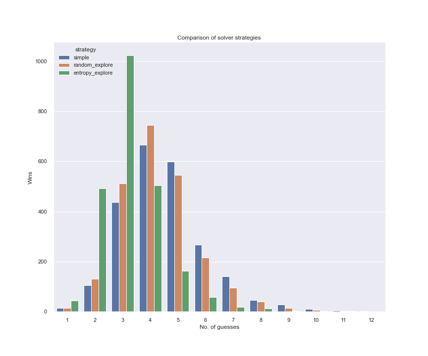

# Wordle Solver 
Wordle is a web-based word game which has become incredibly popular during the pandemic. It became so popular over a while that it was even bought by New York times for a significant sum. The game is a lot of fun to solve manually but I am also solving this computationally. This is my own attempt at coming up with a solution strategy for the game.

# The game
The game is about guessing a five-letter word which changes every day. You get six tries to get it right. After every guess, the game tells you whether any of your letters are in the secret word and whether they are in the correct place. 

My initial attempts involved getting 5-letter words from a well-known corpus like NLTK. But it turns out that wordle uses a two smaller dictionaries which can be extracted from Javascript. The challenges are from the first dictionary which is a smaller one consisting of more familiar words. The second word list is a larger one, which consists of words that are accepted as guesses. Using a dictionary may sound like cheating, but I just wanted explore the algorithm and math behind solver for the game. 

## Base solution
The game is very similar to Master Mind game (which in turn is similar to even older game Bulls and Cow). As a base solution we can use Donald Knuth's Master Mind algorithm. The algorithm works as follows:
1. Create a set of candidates
2. Play an initial guess from this list and get the response
3. If the response is all green (`ggggg`) game is won
4. Otherwise, filter the candidate list to contain only those words that would give the response that we got. For example, if we guessed `ether` and got a response `rgggg` then we can reduce our candidate space to [`other`, `ither`]
5. Use a scoring strategy to choose the next best guess and repeat

Here is an abstract python implementation of parts of this algorithm:

```python
class Solver(ABC):
    def __init__(self, word_list):
        self.word_list = word_list
        self.first_word = self.top_word(word_list)

    def top_word(self, words):
        pass

    def next_guess(self, words, prev_guess=None, prev_result=None, explore=False):
        if not prev_guess:
            return self.first_word, words
        words = list(filter(lambda word: word_matches_pattern(word, prev_guess, prev_result), words))
        return self.top_word(words), words

    @abstractmethod
    def score(self, word, words, char_counts):
        pass
```

Now we need to choose an ideal scoring strategy that would allow us to make first guess as well as choose the best candidates among the remaining after every guess. This is where we can trial a few approaches and see which one gives the best result.


### Character frequency

As a first pass, we can prioritize guessing the words containing most common characters. This should increase our odds of landing on the correct word. For example, here is the frequency of characters appearing in all 5 letter words in the dictionary:


By this criteria, `soare` is the ideal first guess as it is made up of the most frequent characters.

```python
from collections import Counter

def top_word(self, words):
    char_counts = Counter()
    for w in words: char_counts.update(w)
    scores = [(self.score(word, words, char_counts), word) for word in words]
    scores.sort(reverse=True)
    return scores[0][1]

def score(self, word, counter):
    return sum(counter[c] for c in set(word))
```

True enough, it works well most of the time. Almost half the time, it only takes 3 attempts to guess the word correctly. And 9 out of 10 times we are able to guess within 6 attempts.


But we can do better. If we look at the words that take long to solve, there are multiple candidates which are too similar to them. For example, it takes 13 attempts to predict the word `wares`

```
time_solve('wares', word_list)
# Next guess, remaining word list
soare 12972
aesir 61
rales 32
tares 12
nares 11
dares 10
cares 9
pares 8
mares 7
hares 6
gares 5
bares 4
fares 3
wares 2
```

The problem here is that once we reach the 3rd guess `rales`, there are 13 more possibilities for the first char. The only way to find the right answer is to try all 13 possibilities. 

## Random Explore 
One way to mitigate this scenario is if we can sacrifice first few attempts in trying to "explore" the solution space to learn more about valid and invalid characters. This way we are able to zero in on the right answer much quicker. In a way this is like exploration-exploitation strategies seen in reinforcement learning. After exploration, we can revert to frequency based scoring for exploitation.

```python
import random
class RandomExploreExploit(Solver):
    def next_guess(self, words, prev_guess=None, prev_result=None, explore=False):
        words = list(filter(lambda word: word_matches_pattern(word, prev_guess, prev_result), words))
        if explore:
            random.shuffle(words)
            return words[0], words[1:]
        return self.top_word(words), words

    def score(self, word, words, char_counts):
        return sum(char_counts[c] for c in word)
```


Surprisingly this stochastic approach works better than the first method at a lower cost (we don't do any scoring for the first 3 attempts). We are able to win the game 93% of the time. More specifically, my run failed 154 out of 2135 challenges. Can we do better?

## Maximum Entropy
In the previous strategy, we kind of adopted an exploration-exploitation strategy which is normally used for problems whose probability distribution is not known apriori. But in this case, we can do better. Since the word list is already known, we can calculate the probability distribution. So how can we use this probability information to make a good choice?

One thing to note from Master Mind algorithm is that at every turn, we also learn more information about the target word. We can choose words that gives us more information about the target there by reducing our solution space drastically.

As we are talking about expected information available from a probability distribution, we can use Claude Shannon's defintion of information entropy to assign a score. Here is how it is calculated:

1. Let n be the number of words in the solution space
2. Group the words into k partitions based on the pattern it generates when compared with our guess word i.e, if our guess word is `east` group `['fast', 'last']` into same partition as they would output a pattern `rggg` with our guess word.
3. Let _k<sub>i</sub>_ be the size of the _i<sup>th</sup>_ partition after the current guess. 
4. Then the Shannon entropy score of the guess word is _sum{p<sub>i</sub> * -log(p<sub>i</sub>)}_ where _p<sub>i</sub> = i / n_ 

Here is the Python code to calculate entropy:

```python
def generate_comparison_dict(word_list):
    df = pd.DataFrame(None, columns=word_list, index=word_list)
    for i, w1 in tqdm(enumerate(word_list)):
        df[w1][w1] = 'g' * len(w1)
        for w2 in word_list[i + 1:]:
            this_pattern, other_pattern = compare(w1, w2)
            df[w1][w2] = other_pattern
            df[w2][w1] = this_pattern
    with pd.HDFStore(COMPARE_PATTERNS) as hdf:
        hdf.put(key="df", value=df)

def entropy_score(guess, word_list):
    global compare_results_df
    if not isinstance(compare_results_df, pd.DataFrame):
        if not os.path.exists(COMPARE_PATTERNS):
            generate_comparison_dict()
        compare_results_df = pd.read_hdf(COMPARE_PATTERNS)
    probs = compare_results_df.loc[guess][word_list].value_counts()
    return stats.entropy(probs)
```

By this criteria, `tares` is the best starting word which will give us most information. And it performs way better than the above 2 strategies. Out of 2315 target words, it only fails to guess around 35 words within the first 6 attempts leading to a success rate of 98.4%. In fact 90% of the words can be guessed within the first 4 attempts. 

 

## Conclusion
Here is how the three strategies stack up next to each other. 



You can find the source code in `wordle.py`

## Further references
1. The best explanation I have seen for the Information entropy forumula is from Aurélien Géron (https://youtu.be/ErfnhcEV1O8). The concept of information entropy leads to cross entropy which is heavily used as loss function in classification methods. This video is quite short but incredible informative.
2. Grant Sanderson (from 3Blue1Brown) has also released an excellent video (as usual) on solving Worlde using Information theory. He goes much more in detail into the intuition behind the entropy formula.  